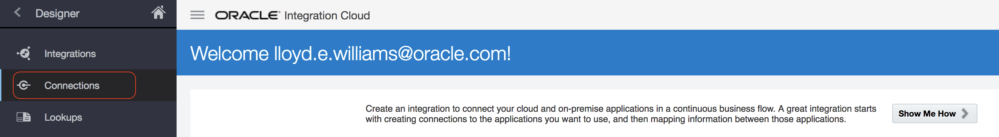
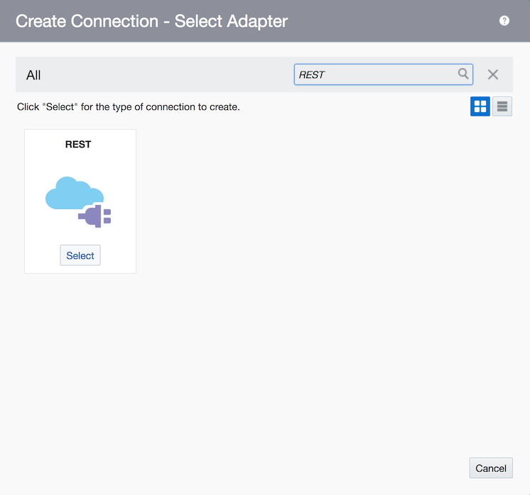
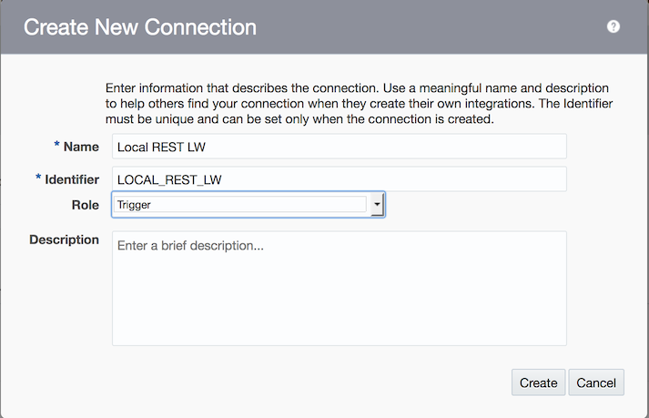
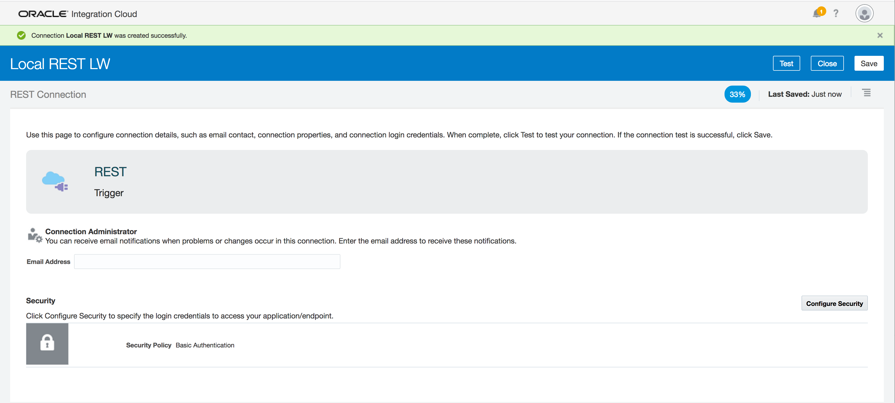
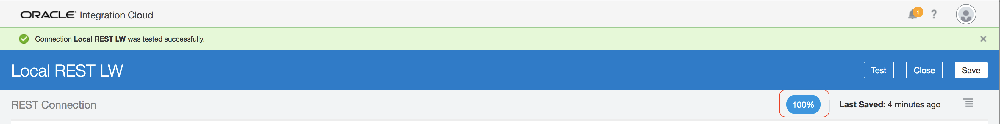

# Tutorial 101: Using the REST Adapter

## Setting up a Basic Connection

### Part 1: New Connection

This tutorial explains how to use the REST adapter to allow a user to make a REST call using JSON to trigger an integration.

From the designer menu, choose **Connections**:

Click on the **Create** button to start creating a new connection:

Type **REST** in the search box to search for the REST adapter:

Select the **REST** adapter.

Name the connection: **`Local REST <your initials>`** as shown in the picture below:

Set the Role to: **Trigger**

Click the **Create** button

The connection is successfully created. We wil use the default security policy: **Basic Authentication**

### Part 2: Test the Connection

Click the **Test** button to test the connection.

The percentage completion indicator should change to 100%. Click on the **Save** button.

Then click the **Close** button.

The connection is now ready to use.
