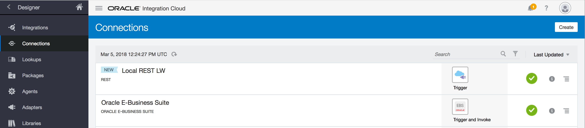

# Tutorial 102: Using the File Adapter

## Configuring a File Adapter

### Part 1: Setting up the Connection Properties

This tutorial explains how to use the File adapter to allow an integration to process file operations like writing to a local file. This integration will leverage a connectivity agent.

From the designer menu, choose **Connections**:

Click on the **Create** button to start creating a new connection:

Type **File** in the search box to search for the file adapter:

Select the **File** adapter.

Name the connection: **`File <your initials>`** as shown in the picture below:

Set the Role to: **Invoke**

Click the **Create** button

### Part 2: Configure the Agent on the Connection

Select the **Configure Agents** button:

Choose the agent provided by your instructor **Lloyds Macbookpro Agent**

Make sure the agent is highlighted in blue and then click the **Use** button.

Click the **Test** button to test the connection. If it is taking a long time and/or fails, ask your instructor to make sure that the agent is running.

The percentage completion indicator should change to 100%. Click on the **Save** button.

Then click the **Close** button.

The file connection is now ready to use.
