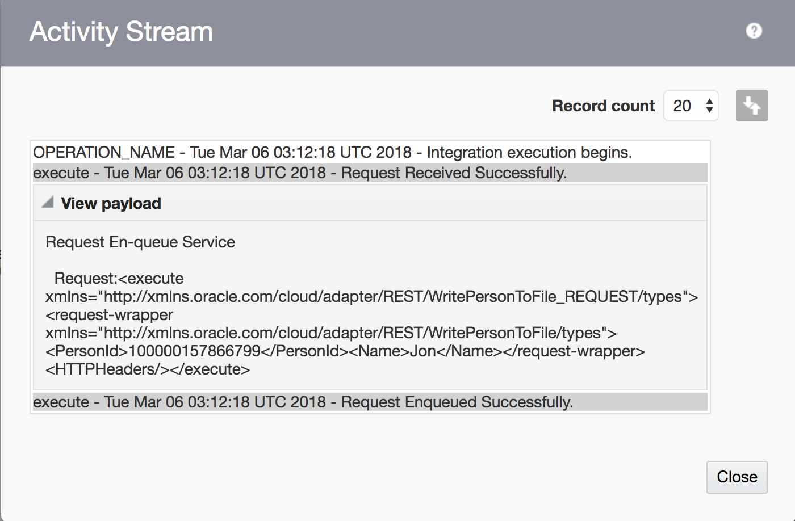

# Tutorial 104: Monitoring

## This tutorial shows you how to monitor integrations

### Part 1: Monitoring Dashboards

From the left-side menu, choose **Monitoring**:

Click on **Dashboards** to view statistics on the health of the system.

Notice that you have the option to change a drop-down menu to view the System Health and the Design-Time metrics. Go ahead and take a look at these dashboards.

### Part 2: Monitoring Agents

Click on the **Agents** to monitor the connectivity agents.

Expand the triangle next to Agent Group name (e.g. Lloyds Macbookpro Agent) to see the status of the individual agents that were previously configured.

### Part 3: Monitoring Integrations

Next click on Integrations in the left-hand side menu. Find the integration that you created containing your initials.

*Notice that you can change the time period if you are interested in viewing the status of the integrations that executed over a longer period of time.*

You can click on the # for each of the status items (e.g. Received, Processed, Success, Errors). Click on the number of **Recieved**,

You will see the tracking page with a list of all the instances.

Notice that the Person Id is shown since this was your tracking field. It is a link that will take you a picture of the integration that is high-lighted in green to show the path that the execution took at run-time.

There is a menu in the top right corner which contains options for viewing all the business identifiers, errors, the audit trail and the activity stream.

Click on **View Audit Trail**. A box will appear showing you the basic activities which took place related to this integration.

Click the **Close** button.

Click on the menu at the top again, but this time choose **View Activity Stream**. This time a different box appears that also contains triangles which can be expanded to view the payload formats.

This is very useful for debugging.

Click the menu again and choose **Business Identifiers**. You should see the values that you provided when you ran the integration, since they were both set-up as tracking fields.

This completes this monitoring tutorial. When you do the more complex **Orchestration** integrations, you will see the value of knowing which path each individual execution of an integration took since you will be able to supply branching logic based on the values that are being processed at run-time.
