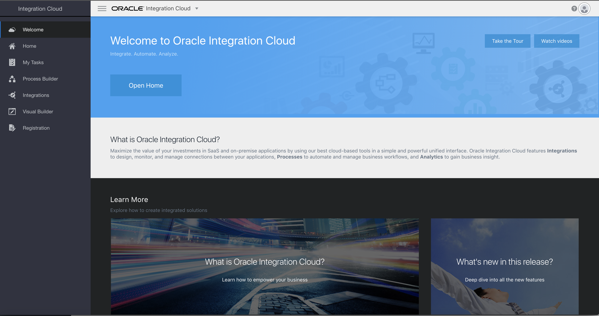

# Lab 01: Introduction to Oracle Integration Cloud
This explains how to get started with the labs in this section

Using your browser login to the Oracle Integration Cloud Environment provided by your instructor.

[Oracle Integation Cloud](https://oicdev-williams.uscom-central-1.oraclecloud.com/ic/home/)

Use the username and password provided by your instructor (e.g. User01)

Click on **Integrations**

You are now ready to start Tutorial 101.
